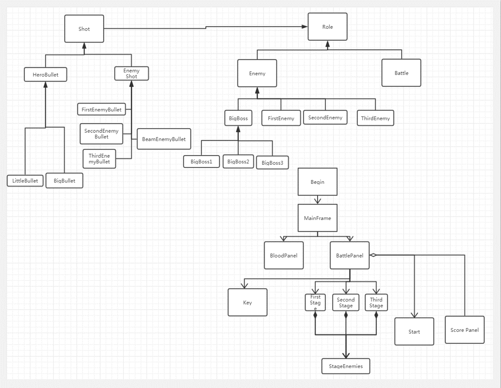
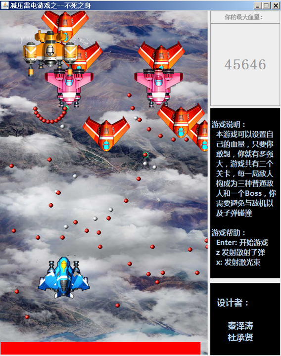
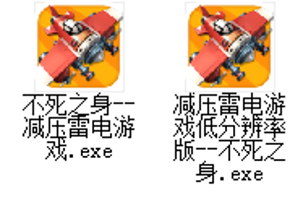

# 雷电游戏项目设计

## 一、需求

以java作为编程语言，整个项目开发模拟雷电游戏的飞机射击游戏。游戏界面的下部是玩家的飞机，可以根据按键控制子弹的发射，上部为敌人的飞机，在界面中随机出现。

在游戏过程当中，用户飞机的移动是被电脑键盘的方向键所控制的，游戏中使用到的飞机、子弹均采用对应的类实现。

主要涵盖的方面有：游戏状态控制功能，游戏界面绘制，玩家游戏控制，游戏界面额素材选择，相撞测试等。

## 二、类图设计

## 三、开发工具以及环境

- IDE：IntelliJ IDEA
- JDK：jdk1.8.0_121

## 四、代码细节

详细内容参考演示PPT 

## 五、小组分工

秦泽涛 （60%）：项目界面编写、自己战斗机代码，子弹代码的编写、素材搜集

杜程贤 （40%）：项目对方战斗机代码的编写，以及项目演示

## 六、成果展示

## 总结

通过完整做一个游戏项目，从一开始UML的设计，到各个类的实现，再到最后的界面绘制，以及把各个类有序组合在一起，最开始的UML图也被不断修改，变成了现在的模样，一开始有一些想法但是由于时间的和技术的原因，只好删去，大致了解了开发一个简单项目的流程，以及在这样的一个开发过程当中需要考虑的各种因素，不仅仅学习和巩固了面向对象的编程思想，也将设计模式（单例模式，策略模式）应用到其中，同时认识到了团队合作的重要性，与同伴一起开发2190行代码（详见PPT），总之，虽然过程比较艰难但是非常有收获。